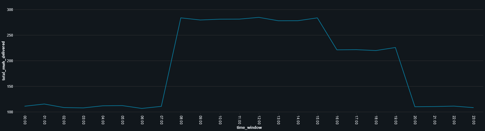
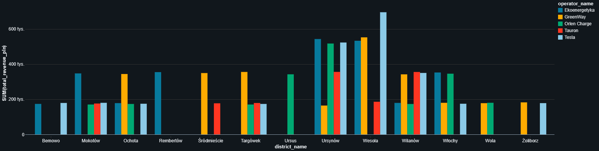

[EN]

# ⚡ Warsaw EV Charging Data Lakehouse

An end-to-end data engineering project analyzing electric vehicle (EV) charging infrastructure across Warsaw, Poland. The solution is built with **Databricks**, **Delta Lake**, and **Spark SQL**, following the **Medallion Architecture** pattern.

---

## 🛠️ Tech Stack
* **Platform:** Databricks
* **Storage Format:** Delta Lake
* **Languages & Query Engines:** PySpark (Python), Spark SQL
* **Analytics & Tools:** Databricks Visualizations, Git

---

## 🏗️ Project Architecture (Medallion Architecture)

[Raw CSVs]

🥉 BRONZE LAYER (Delta Lake): 
 - 4 automated ingestion pipelines: sessions, customers, stations, districts + audit metadata

🥈 SILVER LAYER (Data Quality & Feature Engineering):
 - Power & battery capacity validation (kWh <= battery capacity)
 - Pricing & billing consistency checks
 - Geospatial validation (Warsaw municipal boundary filtering)
   
🥇 GOLD LAYER (Business & Electrical Grid KPIs)
  - gold_hourly_grid_demand (daily power demand profile & peak analysis)
  - gold_district_operator_summary (district ranking & operator market share)

---

## 📊 Key Insights & Visualizations

### 1. Daily Electrical Grid Load Profile
Daily power demand analysis shows a sharp **morning peak starting at 08:00 AM**, driven by morning commuters arriving at Warsaw office districts and plugging in vehicles simultaneously.

### 2. Revenue by District and Operator
Top-grossing EV charging markets in Warsaw are concentrated in suburban, affluent, and high-density residential districts: **Ursynów (> 2.1M PLN)**, **Wesoła (~ 1.9M PLN)**, and **Wilanów (~ 1.4M PLN)**.

---

## 🚀 How to Reproduce

1. Download the `warsaw_ev_lakehouse.ipynb` notebook from this repository.
2. Import the notebook into your **Databricks Community Edition** workspace.
3. Download the [*Warsaw EV Charging*](https://www.kaggle.com/datasets/alperenmyung/warsaw-ev-charging?select=charging_stations.csv) dataset from Kaggle and upload the CSV files to your workspace directory.

[PL]

# ⚡ Warsaw EV Charging Data Lakehouse

Projekt inżynierii danych analizujący infrastrukturę ładowania pojazdów elektrycznych w Warszawie. Projekt został zrealizowany za pomocą **Databricks**, formatu **Delta Lake** oraz relacyjnego **SQL-a** w oparciu o architekturę medalionu.

---

## 🛠️ Sczegóły techniczne
* **Środowisko:** Databricks
* **Format Danych:** Delta Lake
* **Języki i Biblioteki:** PySpark (Python), Spark SQL
* **Narzędzia analityczne:** Databricks Visualizations, Git

---

## 🏗️ Architektura Projektu (Medallion Architecture)

[Raw CSVs]

🥉 BRONZE LAYER (Delta Lake)
  - 4 zautomatyzowane tabele: sesje, klienci, stacje, dzielnice + metadane audytowe
    
🥈 SILVER LAYER (Data Quality & Feature Engineering)
  - Walidacja mocy i baterii (kWh <= pojemność baterii)
  - Weryfikacja cenników
  - Walidacja lokalizacji (granice Warszawy)
    
🥇 GOLD LAYER (Business & Electrical Grid KPIs)
  - gold_hourly_grid_demand (profil dobowy zapotrzebowania mocy)
  - gold_district_operator_summary (ranking dzielnic i operatorów)

---

## 📊 Kluczowe Wnioski i Wizualizacje

### 1. Profil Dobowy Obciążenia Sieci Elektroenergetycznej (Grid Load)
Analiza dobowego zapotrzebowania na energię wykazała gwałtowny **szczyt poranny o godzinie 08:00** związany z dojazdami do biurowców w Warszawie.

### 2. Przychody Dzielnicy i Operatora
Liderami pod względem obrotów na rynku EV w Warszawie są dzielnice o gęstej zabudowie jednorodzinnej i nowo powstałych osiedlach: **Ursynów (>2.1 mln PLN)**, **Wesoła (~1.9 mln PLN)** oraz **Wilanów (~1.4 mln PLN)**.

---

## 🚀 Jak odtworzyć projekt?
1. Pobierz plik `warsaw_ev_lakehouse.ipynb`.
2. Zaimportuj notatnik do obszaru roboczego w **Databricks Community Edition**.
3. Pobierz zbiór danych [*Warsaw EV Charging*](https://www.kaggle.com/datasets/alperenmyung/warsaw-ev-charging?select=charging_stations.csv) z Kaggle i wgraj pliki CSV do swojego katalogu.
